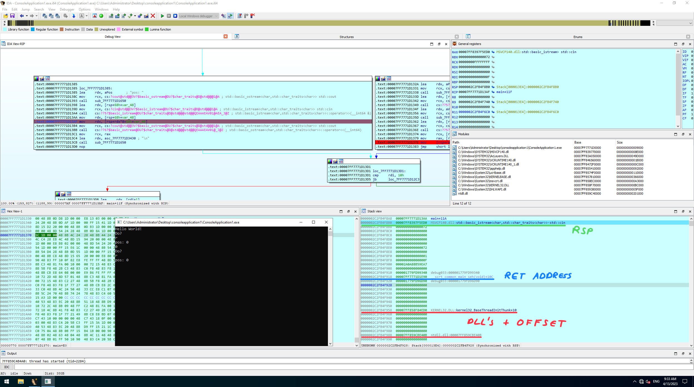

### ID: torukmagto

# Hijacking Windows with ROP

## Program
The application [ConsoleApplication1.exe](./challenge-files/ConsoleApplication1.exe),
which is deployed as a containerized app on a remote server started via
[start.bat](./challenge-files/start.bat),
is a simple console-based application which lets you read and write to a stack
memory location relative to a stack variable:

```CPP
#include <iostream>

int main()
{
    int64_t val, pos;
    int64_t* ptr = &val;

    std::cout << "Hello World!\n";

    while (1)
    {
        std::string cmd;
        std::cout << "Do?\n";
        std::cin >> cmd;

        switch (cmd[0])
        {
        case 'w':
            std::cout << "pos: ";
            std::cin >> pos;
            std::cout << "val: ";
            std::cin >> val;
            ptr[pos] = val;
            break;
        case 'r':
            std::cout << "pos: ";
            std::cin >> pos;
            std::cout << ptr[pos] << "\n";
            break;
        default:
            return 0;
        }
    }
}
```

This obviously lets us modify the stack, the challenge lies in finding a way
to break out of this loop and take control of the instruction flow
to locate `flag.txt` on the remote server and "print" the file to stdout,
which will be redirected to our tcp socket.

### Approaches
One way would be to craft a stack shellcode where we overwrite the
return address of the main function and execute code on the stack directly.
Since the executable has [Data Execution Prevention (DEP)](https://en.wikipedia.org/wiki/Executable_space_protection#Windows)
activated, this is not feasible. The other way is to build a ROP chain, however,
there are a few things we have to consider:
1. Stack Canary: a conventional buffer overflow would overwrite the
    [Security Cookie](https://learn.microsoft.com/en-us/cpp/c-runtime-library/reference/security-init-cookie?view=msvc-170),
    which could prevent us from creating a ROP chain. In this case we can directly write
    to arbitrary stack locations, so this is not a problem.
2. Since [Address Space Layout Randomization (ASLR)](https://en.wikipedia.org/wiki/Address_space_layout_randomization#Microsoft_Windows)
    is present, we cannot assume static addresses; We first have to leak
    the necessary base addresses to construct our exploit. 


### Setup
Included are the [core dll libraries](./challenge-files/dlls_remote) 
of the remote server, which will provide us
with the necessary function offsets in the dll's. 
Since these are core libraries loaded during boot, it is not possible
to load these dll's into memory at runtime of the executable.
Therefore, in order to debug, a local
setup was needed. For this I tried to recreate  the remote server 
using version `Windows Server 2022 10.0.20348 [Desktop Experience]`.
The function offsets of [ucrtbase.dll](./challenge-files/dlls_remote/ucrtbase.dll)
were identical, while [ntdll.dll](./challenge-files/dlls_remote/ntdll.dll) and
[kernel32.dll](./challenge-files/dlls_remote/kernel32.dll) were close to identical.


### Dynamic Analysis
During the read prompt of the application, we can see that
some dll function address are stored on the stack, for example 
[ntdll.dll](./challenge-files/dlls_remote/ntdll.dll) and 
[kernel32.dll](./challenge-files/dlls_remote/kernel32.dll):



Similarly, [ucrtbase.dll](./challenge-files/dlls_remote/ucrtbase.dll)
and a stack address variable reside a few qwords up the stack 
(growth direction, aka. at lower addresses). We can extract the 
base addresses by reading at these positions and removing the offsets.
Now that we have the base addresses we can build an exploit.

### Exploit
The ROP sequences were found using [rp++](https://github.com/0vercl0k/rp).

#### Printing the flag
If we know the location of `flag.txt`, for example if it is
in the directory where the executable and launcher script reside,
we can use the 
[Universal C Runtime (UCRT)](https://learn.microsoft.com/en-us/cpp/c-runtime-library/reference/crt-alphabetical-function-reference?view=msvc-170)
library functions
`_sopen_s`, `_read`, `puts` and `_flushall` to print the flag.
This approach is implemented in [rop_print.py](./rop_print.py).

One thing to bear in mind here is 
[Microsoft's x64 calling convention](https://learn.microsoft.com/en-us/cpp/build/x64-calling-convention?view=msvc-170),
which expects the first four parameters in `rcx`, `rdx`, `r8`, `r9`, respectively.
Starting with the fifth, the other parameters are pushed onto the stack. 
Additionally, at least 32 bytes
have to be allocated before the function call, which is referred to
as the _shadow space_. Furthermore, the stack pointer should be 16 byte aligned.


#### Spawning cmd.exe
The other, easier way is to use the `system(const char* command)` function,
which executes the specified command. We can abuse this by 
simply spawning a new `cmd.exe` process, where we can take control of the system.
Since it takes a single argument, we can simply pass it via the `rcx` register.
Furthermore, we do not care about when the function returns and thus do not
have to worry about the shadow space and stack alignment. This procedure is
implemented in [rop_system.py](./rop_system.py) and the final output is:
```
[x] Opening connection to <ip> on port 4444
[x] Opening connection to <ip> on port 4444: Trying <ip>
[+] Opening connection to <ip> on port 4444: Done

ucrtbase.dll base address: 0x7ff8fff90000
ntdll.dll base address: 0x7ff90243ffd0
stack address on return: 0x59396fd88

[*] Switching to interactive mode

Microsoft Windows [Version 10.0.20348.1607]
(c) Microsoft Corporation. All rights reserved.

C:\Users\localadmin\Downloads>cd ..\Desktop
cd ..\Desktop

C:\Users\localadmin\Desktop>dir
dir
 Volume in drive C has no label.
 Volume Serial Number is -

 Directory of C:\Users\localadmin\Desktop

02/24/2023  05:17 PM    <DIR>          .
02/24/2023  03:42 PM    <DIR>          ..
03/19/2023  05:50 PM                37 flag.txt
               1 File(s)             37 bytes
               2 Dir(s)  34,351,235,072 bytes free

C:\Users\localadmin\Desktop>type flag.txt
type flag.txt
CSCG{Intr0_to_WinPwn_was_n1ce_right?}
```

## Flag
```
// First four letters in uppercase
Flag: CSCG{Intr0_to_WinPwn_was_n1ce_right?}
```