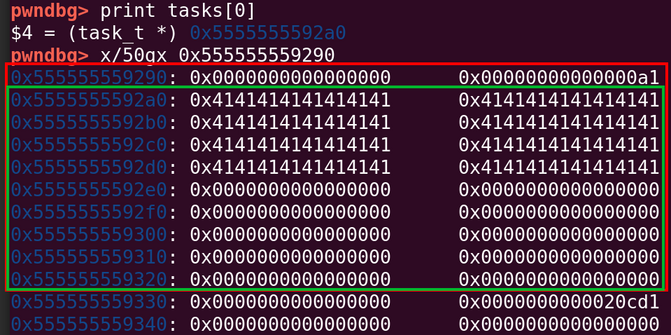
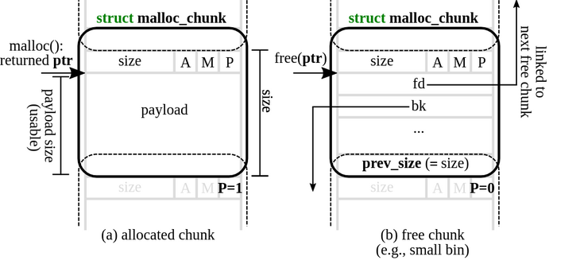
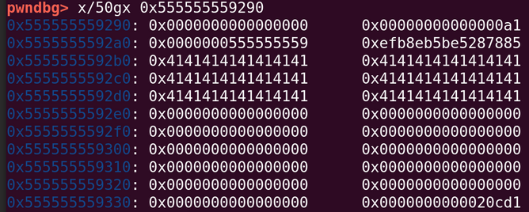
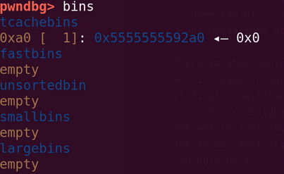
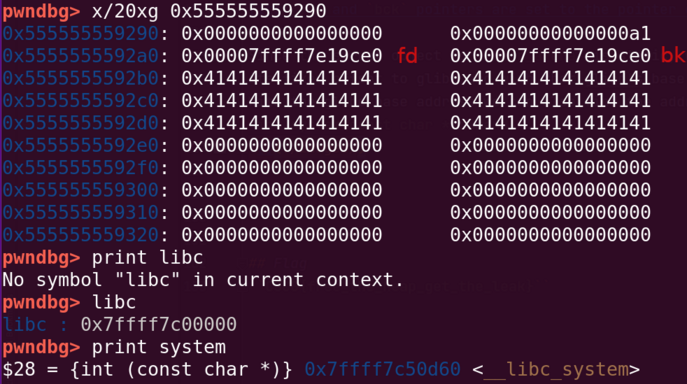

### ID: torukmagto

# Heap Manipulation Craft
(This challenge, deemed an introduction to heap exploits, truly proved to be an extremely 
frustrating problem for my inexperienced a**.)

## Source Code Analysis
The supplied binary is accompanied by its source code [main.c](./challenge-files/main.c),
which at first glance seems to provide an easily exploitable program.
We somehow have to find a way to call 
```c
void execute()
{
    long address;

    printf("address? ");
    address = read_long();
    printf("jumping to %p\n", (void *)address);
    ((void (*)(char *))address)("cat /flag");
}
```
which, given a specific address to a function with one `char *` argument, 
will print the flag from a file. One suitable candidate is the function 
`int system(const char *command)`, which would execute a shell command.

However, since the binary is dynamically linked, there is no easy way to 
obtain the address of the _glibc_ function, as at runtime it would not
remain fixed.

### Use-After-Free
Looking closely, we find that dangling pointers for free'd `task` objects
are not taken care of and are actually still read when printing the `task` names
in `void list_tasks()`. We could exploit this vulnerability, if we can
somehow overwrite the contents of once free'd heap elements.

## Approach
After countless of hours searching, I came across some articles explaining
heap implementation internals and possible exploits, 
some of which still remains unclear to me.
Specifically, how malloc'd blocks, called _chunks_, are laid out in
heap memory and what happens when they are free'd. I recommend you
to read up on this if you haven't already
[[Malloc Internals](https://sourceware.org/glibc/wiki/MallocInternals), [Heap Exploitation](https://heap-exploitation.dhavalkapil.com/)].

Let us quickly inspect a created `task` with a name of 64 A's on the heap:




The green box indicates the memory block for user data, starting
at `0x5555555592a0`; This is what malloc returns. We can see our 64 'A' characters,
`0x41` in hex.
The red box
is the actual allocated chunk, which contains additional metadata
in the header: The size, in this case `0xa` = 160, which is constant
for every `task` element (its `name` member is 144 bytes + 16 bytes alignment on 64-bit systems),
and 1 bit indicating that the previous block is "in use" (the are actually 3 flags for the 
3 least significant bits, but for the sake of brevity we will skip the other two).


[Source: Allocated Chunk and Free'd Chunk](https://tc.gts3.org/cs6265/2019/tut/img/heap/heap.svg)


So what would happen if we were to free this chunk?



Interesting! The first 16 bytes of user data were overwritten with seemingly
random values. But we do not care about these values for now. What is more
interesting is happening behind the scenes.

### Arenas and Bins
When chunks gets free'd, they get stored in various lists based on chunk properties
such as size and/or history, and they are readily available in them until an allocation is requested.
These lists are called _bins_ and are characterized
as follows:
- _Fast Bins_: only very small chunks are stored in here, for fast access
- _Small_ and _Large_ Bins: chunks stored in these bins can be coalesced into bigger chunks
- _Unsorted Bin_: All free'd chunks are initially (not really, see below) put in this bin and are sorted
  and moved into different bin groups later during malloc

There is also another "collection of bins" called _TCache_, which is optimized for 
multi-hreaded programs. In fact, all free'd chunks are moved into the Tcache
at first. Small/Large bins and Fast bins are subdivided based on chunk size, 
i.e. chunks assigned to Small bins and Fast bins are put to its respective size bin,
whereas in individual Large bins the chunk sizes might not be identical.
The former fact also pertains to TCache, where each size cache by default
can hold up to [7 free'd chunks](https://www.gnu.org/software/libc/manual/html_node/Memory-Allocation-Tunables.html#index-glibc_002emalloc_002etcache_005fcount) 
before they get moved to the Unsorted bin.

Let us verify that our first free'd `task` is indeed in one of the caches of TCache:



Let us now rerun and add 8 `tasks` and delete the last 7 `tasks`, keeping
the first `task` untouched:


Certainly, the cache for chunk size `0xa0` holds our 7 freed elements.
The heap dump:


What happens if we free the first `task 0`?


Unsurprisingly, the chunk gets moved to the Unsorted bin. However, 
we can now see that the chunk is pointing to an interesting looking
address `0x7ffff7e19ce0 <main_arena+96>`. Each free'd chunk has forward `fd`
and backward `fd` pointers in the circular list, which is why our free'd
`task 0` at `0x555555559290` is pointing from "left and right" to it.

### Resolution

But why is this `<main_arena+96>` address so important?
Well, it turns out that this address is a pointer to  _Main Arena's_
**top chunk** member variable. An Arena is a region of memory, of which
there can be more than one. The main arena corresponds to the main thread's
initial heap. The top chunk is the largest non-allocated chunk on the heap.
When a free'd chunk is first inserted into the Unsorted bin, 
[its `fd` and `bk` pointers are set to the pointer of the top member variable of main_arena](https://codebrowser.dev/glibc/glibc/malloc/malloc.c.html#4622).

Since the struct object for `main_arena` is static, we can obtain
its fixed offset to glibc and with that glibc's base address.
With the glibc base address we can also find the address of the static function
`int system(const char *command)`.



As seen above, `fd` and `bk` of the free'd `task 0` chunk contain our address 
of interest which can easily be printed by `void list_tasks()`.
 After some manipulation the `system` address can be determined and the flag printed.


## Flag
``CSCG{free_the_heap_get_the_leak}``